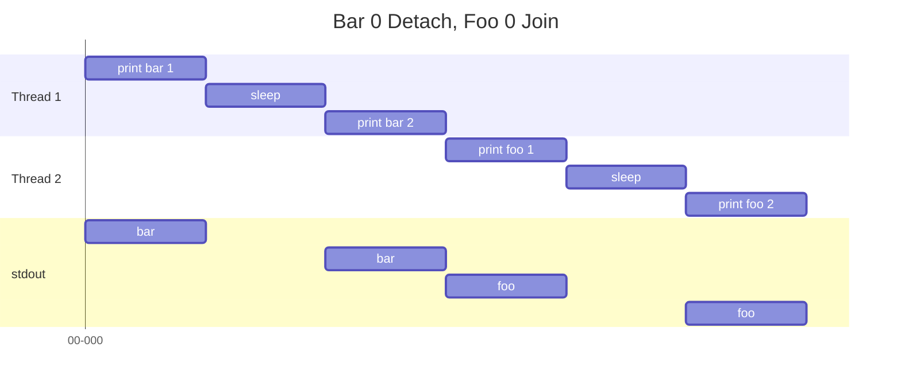

```mermaid
gantt 
    title Bar 0 Detach, Foo 0 Join
    dateFormat ss-SSS
    axisFormat %S-%L
    tickInterval 1minute

    section Thread 1
    print bar 1: a1, 00-000, 0.01s
    sleep: a2, after a1, 0.01s
    print bar 2: a3, after a2, 0.01s

    section Thread 2
    print foo 1: a4, after a3, 0.01s
    sleep: a5, after a4, 0.01s
    print foo 2: a6, after a5, 0.01s

    section stdout
    bar: a1, 00-000, 0.01s
    bar: a3, 00-020, 0.01s
    foo: a4, 00-030, 0.01s
    foo: a6, 00-050, 0.01s

```