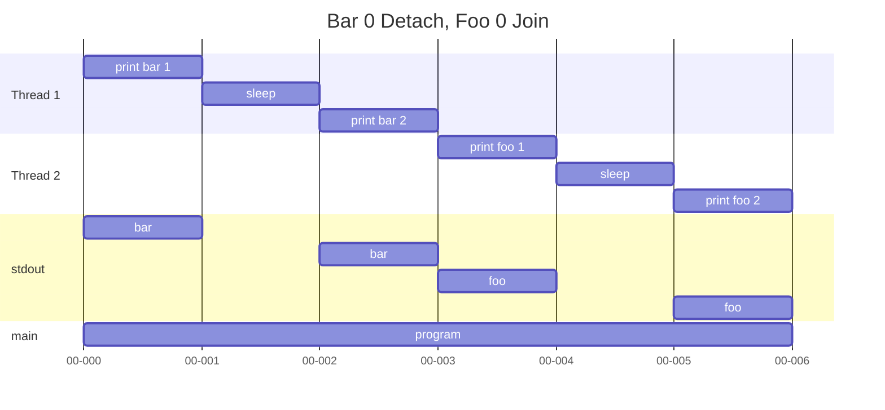
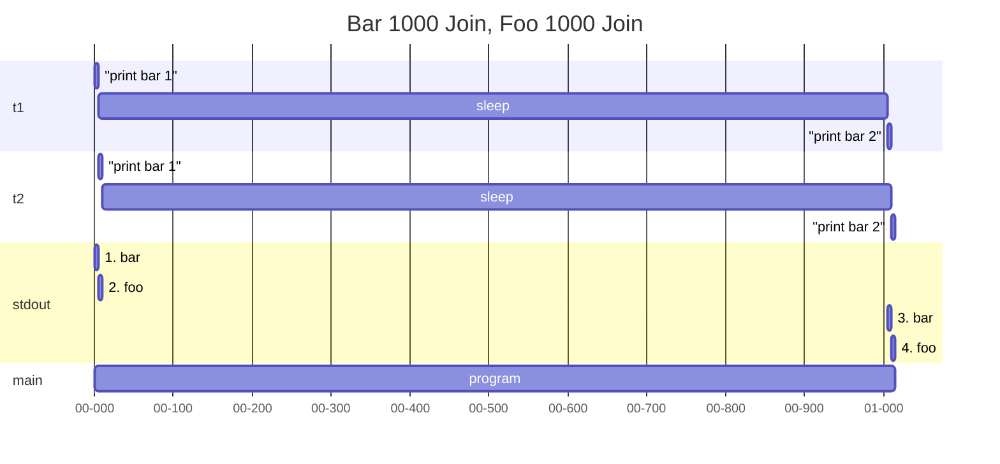
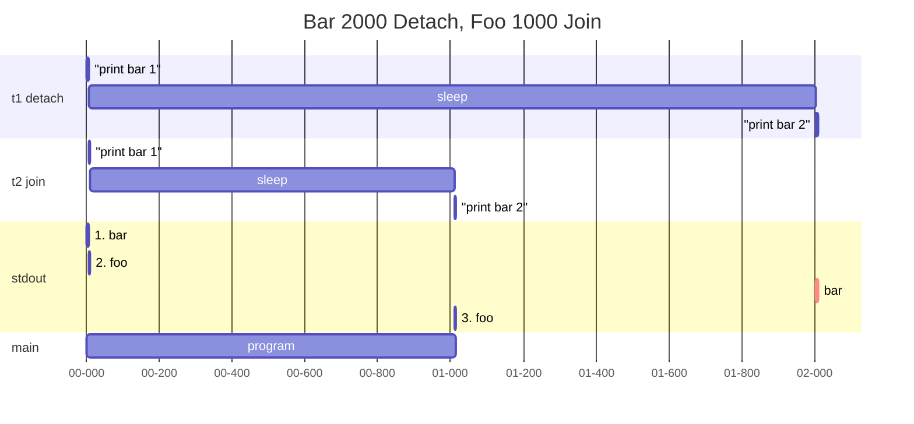
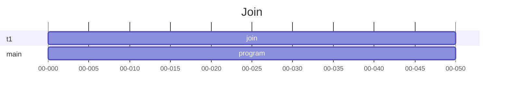
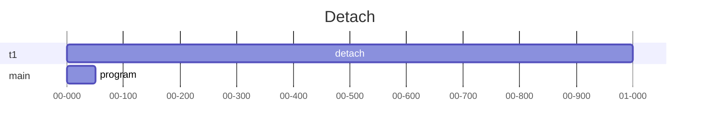

```mermaid
gantt 
    title Bar 0 Detach, Foo 0 Join
    dateFormat ss-SSS
    axisFormat %S-%L
    todayMarker off

    section Thread 1
    print bar 1: a1, 00-000, 0.001s
    sleep: a2, after a1, 0.001s
    print bar 2: a3, after a2, 0.001s

    section Thread 2
    print foo 1: a4, after a3, 0.001s
    sleep: a5, after a4, 0.001s
    print foo 2: a6, after a5, 0.001s

    section stdout
    bar: a1, 00-000, 0.001s
    bar: a3, 00-002, 0.001s
    foo: a4, 00-003, 0.001s
    foo: a6, 00-005, 0.001s

    section main
    program: a10, 00-000, 0.006s
```

```mermaid
gantt 
    title Bar 1000 Join, Foo 1000 Join
    dateFormat ss-SSS
    axisFormat %S-%L
    section t1
    "print bar 1": 00-000, 0.005s
    sleep: 00-005, 1s
    "print bar 2": 01-005, 0.005s

    section t2
    "print bar 1": 00-005, 0.005s
    sleep: 00-010, 1s
    "print bar 2": 01-010, 0.005s

    section stdout
    1. bar: 00-000, 0.005s
    2. foo: 00-005, 0.005s
    3. bar: 01-005, 0.005s
    4. foo: 01-010, 0.005s

    section main
    program: a10, 00-000, 1.015s
```

```mermaid
gantt 
    title Bar 2000 Detach, Foo 1000 Join
    dateFormat ss-SSS
    axisFormat %S-%L
    section t1 detach
    "print bar 1": 00-000, 0.005s
    sleep: 00-005, 2s
    "print bar 2": 02-005, 0.005s

    section t2 join
    "print bar 1": 00-005, 0.005s
    sleep: 00-010, 1s
    "print bar 2": 01-010, 0.005s

    section stdout
    1. bar: 00-000, 0.005s
    2. foo: 00-005, 0.005s
    bar: crit,  02-005, 0.005s
    3. foo: 01-010, 0.005s

    section main
    program: a10, 00-000, 1.015s
```

```mermaid
gantt
    title Join
    dateFormat ss-SSS
    axisFormat %S-%L

    section t1
    join: 00-000, 0.05s
    
    section main
    program: 00-000, 0.05s
```

```mermaid
gantt
    title Detach
    dateFormat ss-SSS
    axisFormat %S-%L

    section t1
    detach: 00-000, 1s
    
    section main
    program: 00-000, 0.05s
```