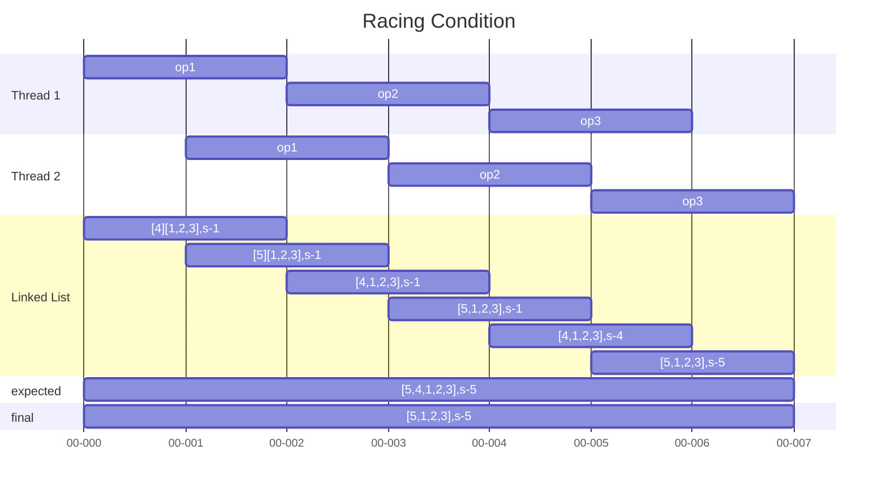
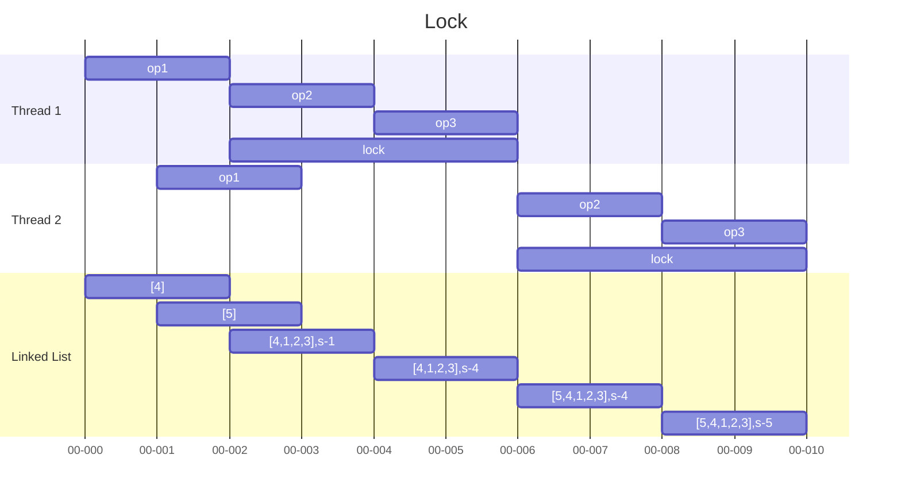

Linked List Append Head

```mermaid
flowchart LR;
    A[1. Add a new node]-->B[2. Set new node next to original head];
    B-->C[3. Set start pointer to new head];
```

```mermaid
gantt 
    title Racing Condition
    dateFormat ss-SSS
    axisFormat %S-%L

    section Thread 1
    op1: 00-000, 0.002s
    op2: 00-002, 0.002s
    op3: 00-004, 0.002s

    section Thread 2
    op1: 00-001, 0.002s
    op2: 00-003, 0.002s
    op3: 00-005, 0.002s

    section Linked List
    [4][1,2,3],s-1: 00-000, 0.002s
    [5][1,2,3],s-1: 00-001, 0.002s
    [4,1,2,3],s-1: 00-002, 0.002s
    [5,1,2,3],s-1: 00-003, 0.002s
    [4,1,2,3],s-4: 00-004, 0.002s
    [5,1,2,3],s-5: 00-005, 0.002s

    section expected
    [5,4,1,2,3],s-5: 00-000, 0.007s

    section final
    [5,1,2,3],s-5: 00-000, 0.007s
```

```mermaid
gantt 
    title Lock
    dateFormat ss-SSS
    axisFormat %S-%L

    section Thread 1
    op1: 00-000, 0.002s
    op2: 00-002, 0.002s
    op3: 00-004, 0.002s
    lock: 00-002, 0.004s

    section Thread 2
    op1: 00-001, 0.002s
    op2: 00-006, 0.002s
    op3: 00-008, 0.002s
    lock: 00-006, 0.004s

    section Linked List
    [4]: 00-000, 0.002s
    [5]: 00-001, 0.002s
    [4,1,2,3],s-1: 00-002, 0.002s
    [4,1,2,3],s-4: 00-004, 0.002s
    [5,4,1,2,3],s-4: 00-006, 0.002s
    [5,4,1,2,3],s-5: 00-008, 0.002s
```