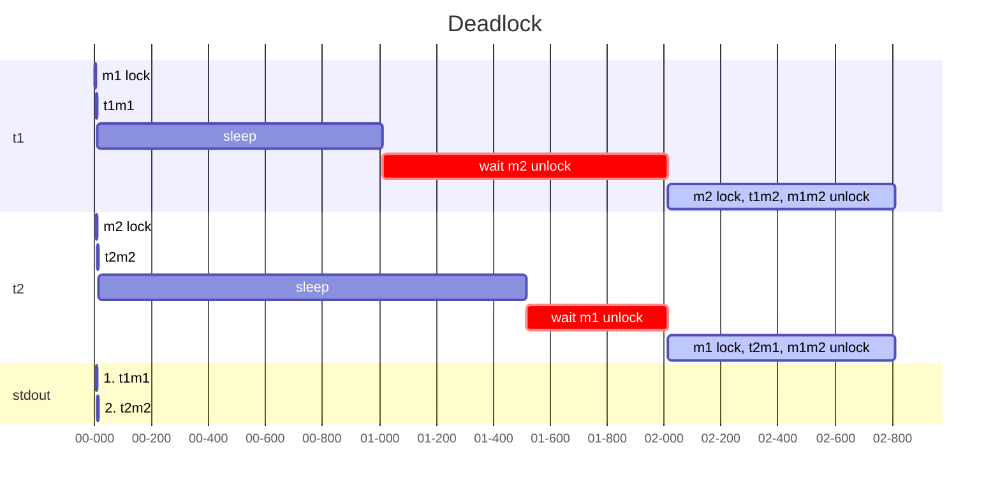
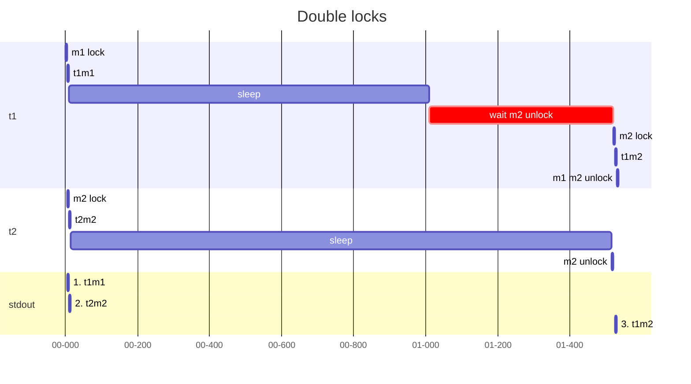

```mermaid
gantt
    title Deadlock
    dateFormat ss-SSS
    axisFormat %S-%L
    section t1
    m1 lock: 00-000, 0.005s
    t1m1: 00-005, 0.005s
    sleep: 00-010, 1s
    wait m2 unlock: crit, 01-010, 1s
    m2 lock, t1m2, m1m2 unlock: active, 02-010, 0.8s

    section t2
    m2 lock: 00-005, 0.005s
    t2m2: 00-010, 0.005s
    sleep: 00-015, 1.5s
    wait m1 unlock: crit, 01-515, 0.495s
    m1 lock, t2m1, m1m2 unlock: active, 02-010, 0.8s

    section stdout
    1. t1m1: 00-005, 0.005s
    2. t2m2: 00-010, 0.005s
```

```mermaid
gantt
    title Double locks
    dateFormat ss-SSS
    axisFormat %S-%L
    section t1
    m1 lock: 00-000, 0.005s
    t1m1: 00-005, 0.005s
    sleep: 00-010, 1s
    wait m2 unlock: crit, 01-010, 0.51s
    m2 lock: 01-520, 0.005s
    t1m2: 01-525, 0.005s
    m1 m2 unlock: 01-530, 0.005s


    section t2
    m2 lock: 00-005, 0.005s
    t2m2: 00-010, 0.005s
    sleep: 00-015, 1.5s
    m2 unlock: 01-515, 0.005s

    section stdout
    1. t1m1: 00-005, 0.005s
    2. t2m2: 00-010, 0.005s
    3. t1m2: 01-525, 0.005s
```