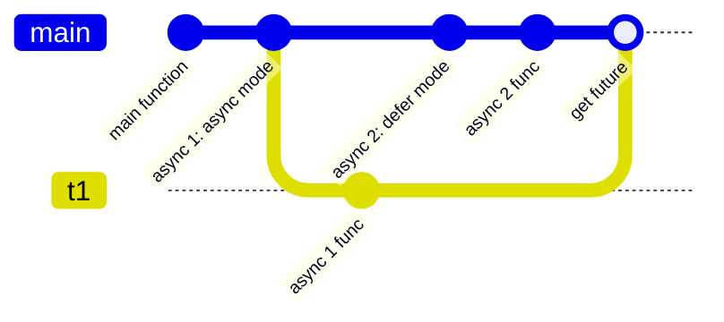

### Difference between Async and Defer Modes

```mermaid
gitGraph
    commit id: "main function"
    commit id: "async 1: async mode"
    branch t1
    checkout t1
    commit id: "async 1 func"
    checkout main
    commit id: "async 2: defer mode"
    commit id: "async 2 func"
    merge t1 id: "get future"
```